# SQL Practice 

## Summary

  SQL is very similar to Excel. I learned the relational data between tables that you create. You're able to join tables together that share similar data such as the box office data with the data for the movie. You're able to create tables, add rows, remove rows, alter tables and sort the data however you'd like it. You can be very specific on what "cell" needs to be changed or swapped like the year of the movie or name of the movie. It's fairly easy to mess up a lot of data by changing something that is shared amongst other rows. For example if there are multiple movies released the same year, you can change the year of the movie release if you only choose that portion of data.

Screenshots:
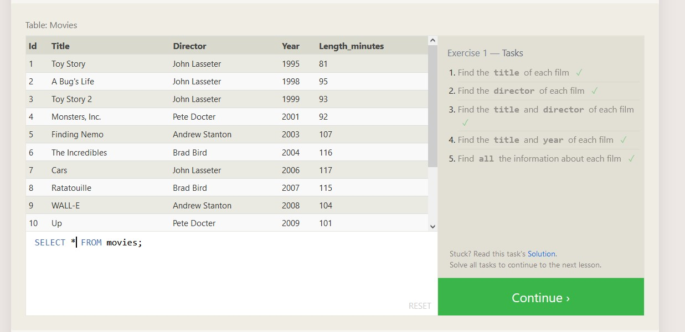
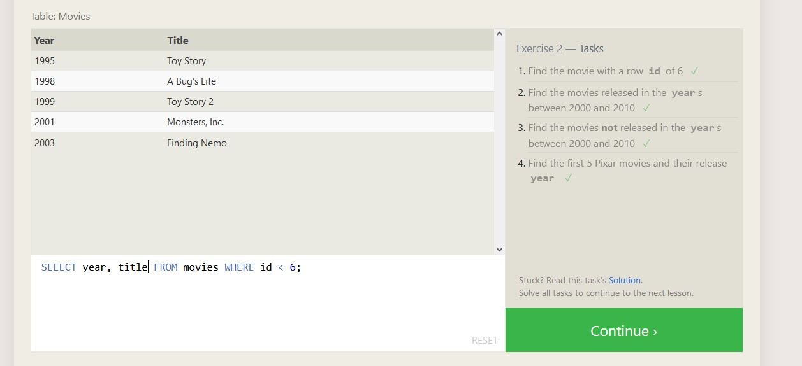
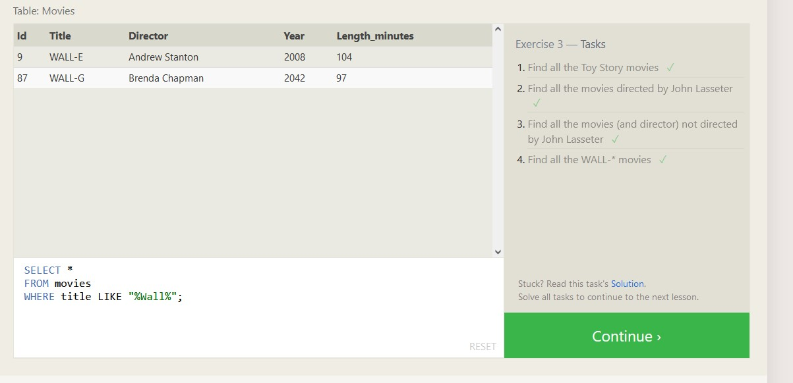
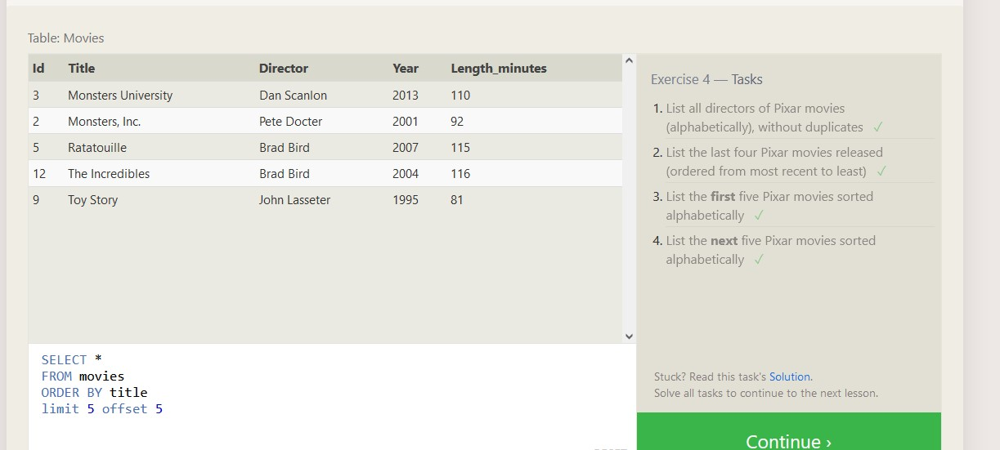
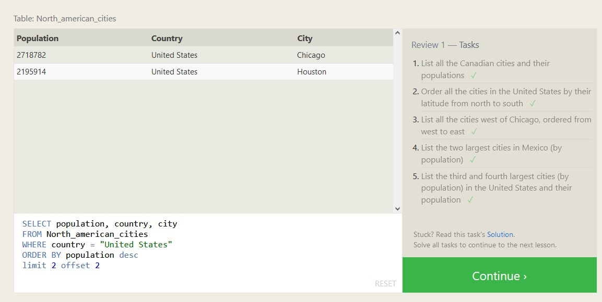
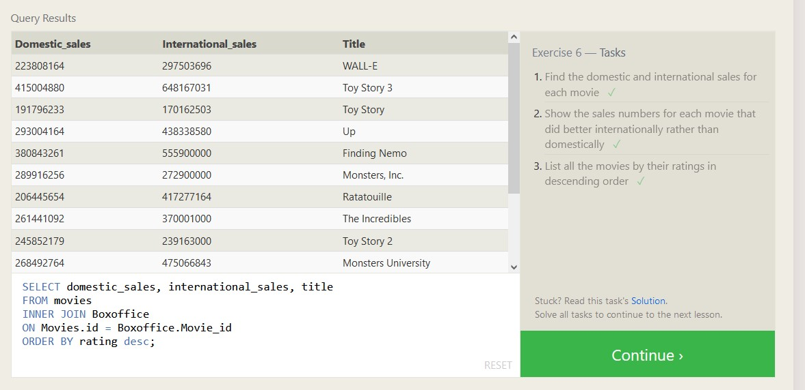
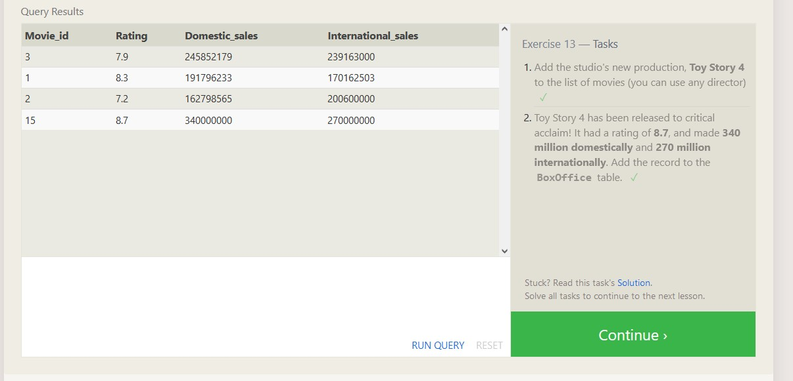
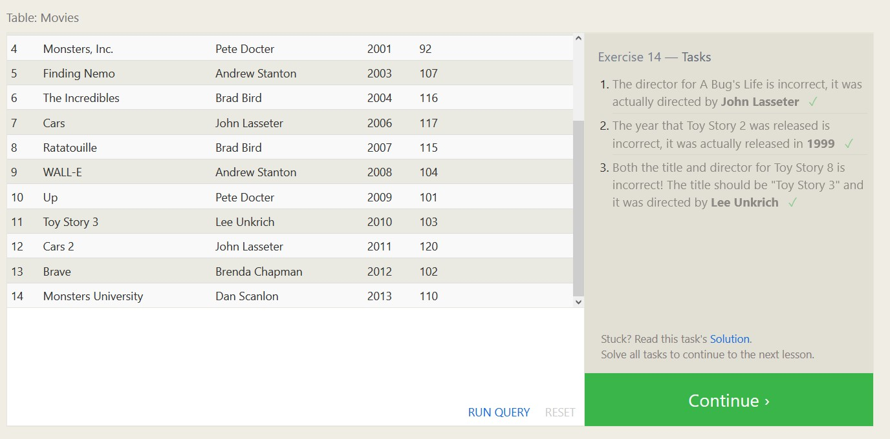
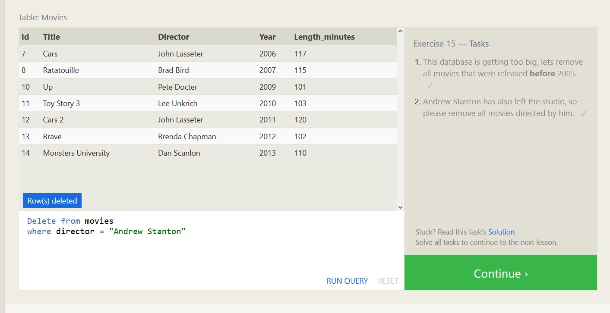
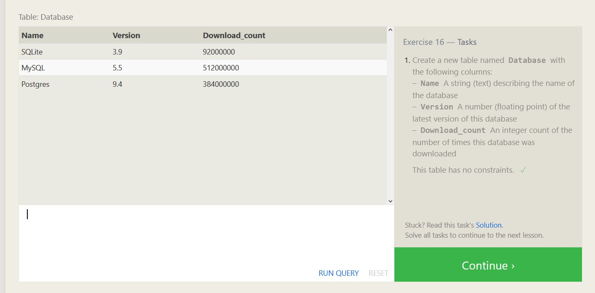
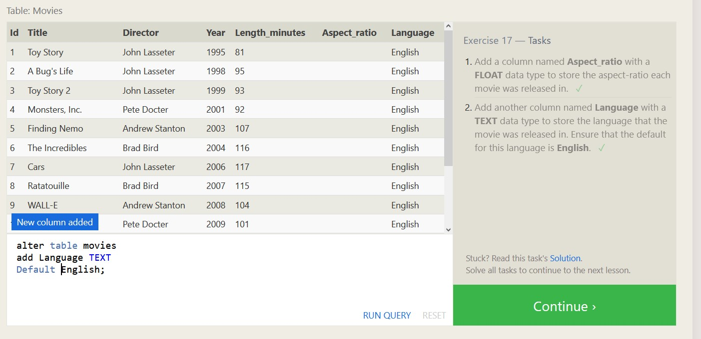
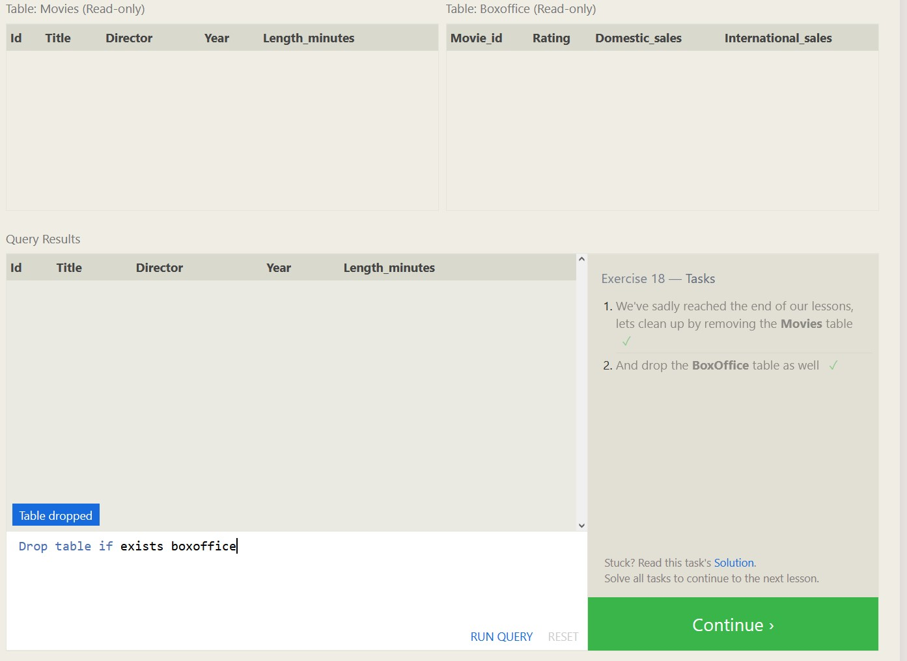

